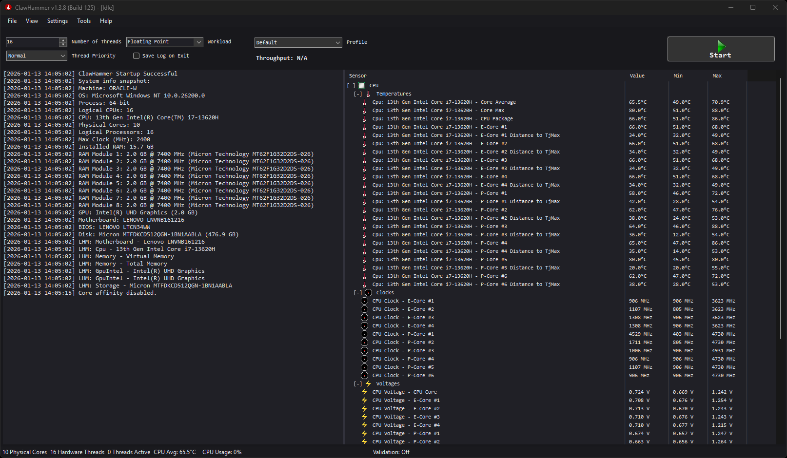
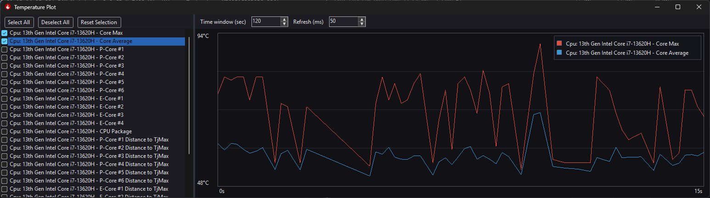
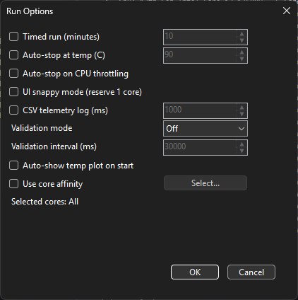
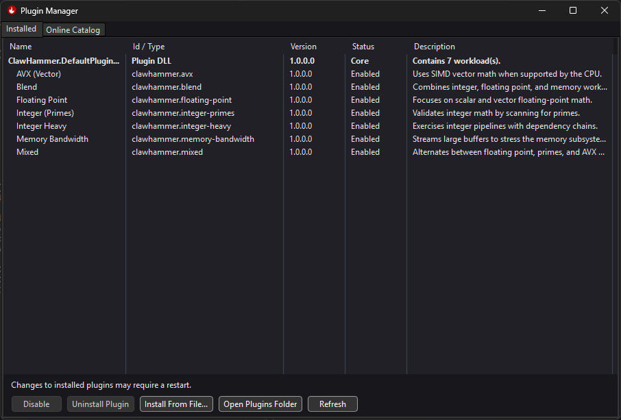
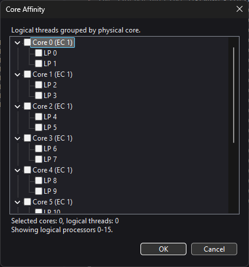

# ClawHammer

ClawHammer is a Windows CPU stress tester with plugin-based workloads, live telemetry,
and a validation loop.

## Features
- Plugin workloads (drop-in DLLs) with Plugin Manager (local install and online catalog).
- Default workloads: Floating Point, Integer Primes, AVX (Vector), Mixed, Blend,
  Integer Heavy, Memory Bandwidth.
- Sensor tree via LibreHardwareMonitor (temps, clocks, voltages, throttle) with
  current/min/max columns.
- Validation loop with per-thread status in the Validation Monitor.
- Worker crash handling for plugin stability; crashes are logged and the run stops safely.
- Core affinity grouped by physical core; logs show thread-to-core mapping.
- Auto-stop on temperature or throttling, timed runs, UI snappy mode, and core affinity.
- CSV telemetry logging and temperature plot with persistent selection and refresh rate.
- GitHub release update check with an in-app updater.

## Screenshots

## Requirements
- Windows 10/11
- .NET 10 Desktop Runtime (SDK required for building)
- Administrator rights recommended for full sensor access (PawnIO)

## Build
- Open `ClawHammer.sln` in Visual Studio 2022 or later.
- Build the `ClawHammer` project (x86/x64 configs).

## Run
- Launch `ClawHammer/bin/x64/Release/net10.0-windows7.0/ClawHammer.exe`.
- Plugins live in the `plugins` folder next to the executable.

## Plugins
- ClawHammer loads any class implementing `IStressPlugin` from DLLs in `plugins`.
- Install plugins via Plugin Manager or drop a DLL/ZIP into `plugins` and restart.
- Default workloads ship in `ClawHammer.DefaultPlugins.dll`.

## Validation Monitor
- Shows per-thread validation status (including core/LP labels).
- Opens automatically when validation is enabled (also in View menu).

## Notes
- Sensor icons are loaded from the `ClawHammer/icons` folder at runtime.
- Non-runtime assets are stored in `assets/`.
- UI layout and plot selections are saved in `ui-layout.json`.

## Version History
### 1.3.8 (Build 128)
- Worker crash handling to prevent app-level crashes; errors are logged and validation updates.
- Core affinity limits workers to the selected logical threads.

### 1.3.8 (Build 125)
- Plugin architecture with Plugin Manager and SDK (VB/C# samples and templates).
- Sensor tree view with min/max columns, plus temperature plot refresh control.
- Validation Monitor with per-thread status and core/LP labels.
- Core affinity grouped by physical core; thread logs show actual core/LP.
- GitHub release update check with in-app updater UI.
- LibreHardwareMonitor 0.9.5 with PawnIO signed driver support.

## License
GPL-3.0. See `LICENSE`.

## Plugin SDK
See `sdk/README.md` for plugin development docs, samples, and templates.
